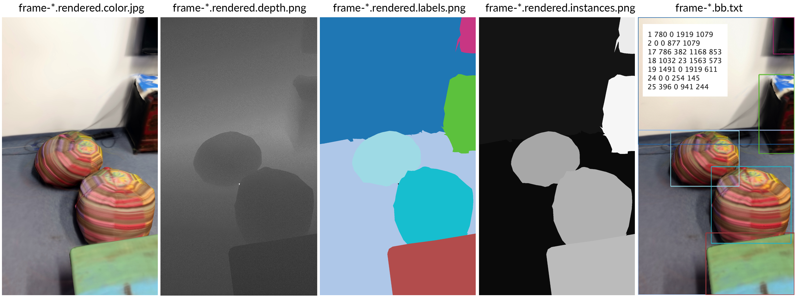

## Build and Run
Necessary dependencies as well as instructions on how to build and run our library and examples is described [here](https://github.com/WaldJohannaU/3RScan/tree/master/c++/README.md).

## References vs. Rescans: What's the difference?
The scans in 3RScan are organized by scene (being an indoor space e.g. a kitchen or a bedroom). We provide multiple scans of each indoor scene, one scan has been selected as the reference / initial scan (usually the most complete or the first scan). Each scene is identified by the scan identifier (hash value), where **`scene["reference"]`** is the scan id of the initial scan as follows [**`3RScan.json`**](http://campar.in.tum.de/files/3RScan/3RScan.json):

```javascript
[
  {
    // id of the initial scan (reference)
    "reference": "531cff08-0021-28f6-8e08-ba2eeb945e09", 
     ... // data of the reference scan
    "scans": [ // rescans
      { "reference": "531cff10-0021-28f6-8f94-80db8fdbbbee", ... }, // data of 1st rescan
      { "reference": "19eda6f4-55aa-29a0-8893-8eac3a4d8193", ... }, // data of 2nd rescan
      { ... }
    ]
  }
]
```

All the other remaining scans are the rescans, **`scene["reference"]["scans"]`**, their annotations are with respect to the reference scan. By doing so, object or scene alignments can easily be recovered between one rescan to another (by transforming from rescan to reference and then via the inverse back to another rescan). We provide the functions **`IsRescan()`** and **`IsReference()`** in our library to easily determine if a scan Id belongs a reference or rescan and **`GetReference()`** to obtain the reference Id of a rescan.

```cpp
  RIO::RIOConfig config(data_path);
  RIO::RIOLib rio(config);
  rio.IsRescan(scan_id); // retruns true if scan_id is a rescan
```

#### How to determine if a scan belongs to the train, val or test split?
Each scene with the reference and all corresponding rescans in [**`3RScan.json`**](http://campar.in.tum.de/files/3RScan/3RScan.json) are assigned a split, see **`type`** field in json file. We also provide a list of ids here: [**`splits`**](https://github.com/WaldJohannaU/3RScan/tree/master/splits). Please note that these files only include references. A full list of scan ids including rescans can be found here: [**`train`**](http://campar.in.tum.de/files/3RScan/train_scans.txt), [**`val`**](http://campar.in.tum.de/files/3RScan/val_scans.txt), [**`test`**](http://campar.in.tum.de/files/3RScan/test_scans.txt).

#### How to align the rescan 3D models and camera poses with the reference scan?
Scene-to-scene transformations to align the 3D maps are available in the json-metafile [**`3RScan.json`**](http://campar.in.tum.de/files/3RScan/3RScan.json). Please note that the transformation of the translation in the json file is in millimeter while the 3D models are stored in meters. We provide the function **`Transform2Reference()`** as an example on how to use those in our **`rio_example`** project. The same procedure applies when aligning the ground truth trajectories, see function **`GetCameraPose()`**.

## Dataformat: How is the data stored?
The [README](https://github.com/WaldJohannaU/3RScan/tree/master/README.md) gives a rough overview about the available files in 3RScan. Please note, our download script allows to download a subset of the dataset (by filtering either by file name or scan id).

### What is the format of of the depth map?
The depth map is a 16 bit image and stores depth values as an unsigned short in millimeter. Please note that the camera poses are in meters, so you might need to multiply with 0.001 or 1000. 

If the quality of the Tango depth image is not sufficient for your task I recommend to use the intrinsics and the 3D mesh to simply render the corresponding depth map (see render function example).

### What is the coordinate system of the camera poses?
The camera pose stored in the **`.pose.txt`** files gives the pose of the RGB sensor as a transformation from the RGB camera to the world coordiante system. 

### Are the color and depth images calibrated?
The color and depth images are calibrated (you do not need to do this manually), the depth and RGB image only differ in their size (resizing would do the job). Since the **`*.pose.txt`** is the camera pose of the RGB sensor and the depth is aligned with backprojection is straight forward: You need the intrisncis stored in **`_info.txt`** to backproject the depth image or likewise to render the 3D mesh / segmentation in the RGB frame. See backprojection and rendering for more details.

## Semantics, semantics, semantics
There are quite some files to possibly parse to get the semantic labels, you have many options depending on what you want to do in your code. Let's answer some of the question you might have:

### The ply files seem to be binary - how do I read them?
The ply files are indeed stored as binary. Our code provides a function **`ReSavePLYASCII()`** that uses **`tinyply`** to load the binary ply and to save it in ASCII format. 

### How do I get the semantic labels?
There are two ways to extract the semantic class of each 3D point: either via the **`semseg.json`** or via [**`objects.json`**](http://campar.in.tum.de/files/3DSSG/3DSSG/objects.json). The function **`PrintSemanticLabels()`** shows simple code to print these labels for a specific scene. A **`semseg.json`** is provided per scan as follows:

```javascript
{
  "sceneId": "tangonet.8eabc405-5af7-2f32-86d2-d757fa7b019d",
  ...
  "segGroups": [
    {
      "id": 15,
      "objectId": 15,
      "label": "window",
      "segments": [ 21, 175, ... ],
      "obb": {
        "centroid": [ 2.15, 2.17, -1.18 ],
        "axesLengths": [ 4.57, 0.62, 4.14 ],
        ...
      }, 
      ...
    }, {
      "id": 29,
      "objectId": 29,
      "label": "plant",
      ...
    }, {
      "id": 14,
      "objectId": 14,
      "label": "windowsill",
      ...
    }
```

In **`semseg.json`**, **`json["segGroups"]`** is the list of instances in this particular scene with **`objectId`** or **`Id`** being the instance id of a specific object instance in the 3D scene and label being the assigned semantic label. The 3D geometry of the objects is stored in **`labels.instances.annotated.ply`** - the **`objectId`** of each 3D vertex is stored in a costum vertex property, see header: 

```javascript
ply
format binary_little_endian 1.0
comment STK generated
element vertex 83385
property float x
property float y
property float z
property uchar red
property uchar green
property uchar blue
property uint16 objectId  // that is the objectId that maps to the objectId in semseg.json
...
element face 27795
property list uchar int vertex_indices
end_header
```

On the other hand, **`objects.json`** provides the labels for all scenes parsed in one file (plus giving additional information such as object attributes). 

```javascript
{
  "scans": [
    {
      "scan": "00d42bed-778d-2ac6-86a7-0e0e5f5f5660", // unique scan identifier (either a reference or a rescan)
      "objects": [
        {
          "global_id": "6", // global Id of the semantic label (unique for each semantic class e.g. chairs, bed, etc.)
          "label": "floor", // semantic label of the object (same as "label" in semseg.json)
          "ply_color": "#aec7e8", // color of the object in the labels.instances.annotated.ply
          "id": "1", // instance Id of the object (same as "objectId" or "Id" in semseg.json)
          "attributes": {
            "color": [ "dark", "gray" ], ...
          },
          ...
        },
        {
          "global_id": "36",
          "label": "bed",
          "ply_color": "#ff7f0e",
          "id": "4",
          "attributes": {
            "state": [ "messy" ],
            "shape": [ "square" ]
          }
        }, ...
      ]
    }, {
      "objects": [ ... ],
      "scan": "4acaebba-6c10-2a2a-8650-34c2f160db99"
    }
  ]
}
```

### How to map this to a global instance Id?
Please note that the **`objectId`** is scene specific (1 might be the floor in one scene but could be a sofa in another). To get a 3D semantic segmentation with a consistnt, global instance ID check out the function **`RemapLabelsPly()`**. The global instance ID produced here in a **`*.ply`** (check header) is the same as the **`global_id`** in **`objects.json`**.

## Advanced 2D or 3D Processing
You might want to do some more complex processing; check out the following FAQ about 2D / 3D processing with 3RScan:

### How to get 3D bounding boxes?
It's easy: Our **`semseg.json`** provides oriented bounding boxes (you simply need to read **`json["segGroups"]["obb"]`**). Detailed instructions on how to get the 2D bounding boxes can be found below. 

### Backproject: How to get a 3D point cloud from a given depth image?
As described above (see **Dataformat**) the color and depth images are calibrated. The intrinscis and the RGB and depth image can be found in **`_info.txt`**. An example on how to read and backproject them to get a colored 3D point cloud is shown in our example code using the function **`Backproject(scan, frame_id)`**. The produced colored 3D point cloud aligns with the 3D reconstructions **`*.obj`** and **`*.ply`**.

### How to render scans in 3RScan?
In this repository we provide the project **`rio_renderer`**. The project provides an OpenGL renderer **`RIO::Renderer`** and a corresponding rendering function **`render()`** to produce 2D semantic images (colors and 16 bit instance images), 16bit depth images or RGB color renderings. The rendering function is designed to work with 3RScan and uses the intrinsics **`m_calibrationColorIntrinsic`** in **`_info.txt`** and the 3D models mesh.refined.obj and **`labels.instances.annotated.ply`** to render the corresponding 2D images. The code generates the following files:



### How to render all camera poses at once for one scan in 3RScan?
The project **`rio_renderer`** provides a predefined executable called **`rio_renderer_render_all`** that renders all camera poses for a given scan in 3RScan. It produces all artifacts that the **`rio_renderer`** creates, for every 
camera pose (i.e. 2D semantic images (colors and 16 bit instance images), 16bit depth images or RGB color renderings).

### How to get the 2D bounding boxes?
Computing 2D bounding boxes first requires to render the semantic instance image. Based on the 2D instance map, 2D bounding boxes can be derived. We provide example code in **`rio_renderer`**, see **`Get2DBoundingBoxes()`**. The code also save a file **`*.bb.txt`** with the 2D bounding boxes of the current view where each line starts with the instance Id followed by the min / max corners of the bounding box.

### How to filter instances that are barely visible in an image (i.e. occluded)?
The project **`rio_renderer`** also computes two visibility metrics: occlusion and truncation. For each instance in each rendered image they contain the amount of pixels that are visible, occluded by other instances, and truncated at the image borders. This allows to filter instances based on the degree of occlusion and truncation, i.e. only use an instance that is at most 30% occluded and 20% truncated. In the following we describe the visibility metrics in more detail.

The project **`rio_renderer`** provides the file `frame-xxxxxx.visibility.txt` that is used to store the calculated truncation and occlusion metrics. Its content are rows with following syntax:
`<instance_id> <truncation_number_pixels_original_image> <truncation_number_pixels_larger_fov_image> <truncation_metric> <occlusion_number_pixels_original_image> <occlusion_number_pixels_only_with_that_instance> <occlusion_metric>` 
where

- `instance_id`: as defined in `objects.json`

- `truncation_number_pixels_original_image`: how many pixels from instance are visible in the original part of the image when rendered with a larger fov, but only looking at the original crop.

- `truncation_number_pixels_larger_fov_image`: how many pixels from instance are visible in the larger fov image.

- `truncation`: percentage of how much the object is cut off at the edges w.r.t. rendering with larger FOV. 1 means "the whole object is visible in the original image, it is not cut off at image edges". 0<x<1 means "the object is visible to x% in the original image, the rest is cut off at image edges but is visible with a larger FOV".

- `occlusion_number_pixels_original_image`: how many pixels from instance are visible in original image with original fov.

- `occlusion_number_pixels_only_with_that_instance`: how many pixels from instance are visible in original image with original fov when only rendering that instance.

- `occlusion`: percentage of how much the object is cut off by other objects in the original image (without larger FOV). 1 means "the whole object is visible in the original image, it is not cut off by other objects in the image". 0<x<1 means "the object is visible to x% in the original image, the rest is cut off by other objects in the image, but is visible in the original FOV when only rendering that single object"

**Caveat:** Note that `truncation_number_pixels_original_image` and `occlusion_number_pixels_original_image` are not the same number. This is because we used a larger FOV for rendering the image in truncation and therefore the absolute number of pixels is less because we look at a smaller width/height in total. When using the number of pixels as object mask, we should therefore use the `occlusion_number_pixels_original_image`.

One example `frame-xxxxxx.visibility.txt` file can look like this:

```
1 39326 76215 0.515988 158780 268173 0.59208
2 10764 108274 0.0994144 41363 67629 0.611616
17 2663 6377 0.417594 10974 18437 0.595216
18 3190 3190 1 12769 12770 0.999922
19 36676 37854 0.96888 146999 146999 1
22 12373 187178 0.0661029 56761 56761 1
24 4345 20030 0.216925 14900 14900 1
25 13322 13325 0.999775 53334 56449 0.944817
28 2171 8714 0.249139 7958 8392 0.948284
33 2149 8319 0.258324 8267 8297 0.996384
```

These files get computed when calling the executable `rio_renderer_render_all` this way:

`./rio_renderer_render_all <data_path> <scan_id> <render_output> <render_only_occlusions> <fov_scale>`

e.g.

`./rio_renderer_render_all /path/to/3RScan/ 5630cfc9-12bf-2860-84ed-5bb189f0e94e /path/to/3RScan/tmpOutputDir 1 2.0`

where:

- `render_only_occlusions`: if only the `frame-xxxxxx.visibility.txt` files should be created (int value). If 0: also the other images will be rendered with the normal fov setting and saved (i.e. 2D semantic images (colors and 16 bit instance images), 16bit depth images or RGB color renderings). If 1: only the new file will be saved to disk. (default: 0)
- `fov_scale`: enlargement factor, e.g. 2.0 means that the enlarged image will have a twice as large FOV (default: 2.0)

You need to specify both arguments `<render_only_occlusions> <fov_scale>` for the current implementation to use any of them.

### Why do the number of vertices in the .obj and .ply differ?
The reason for this is the annotation interface / segmentation code that we used to get the labels. However, the number of faces is the same, see **`ExportModel`** on how to extract the 3D model of a specific instance from the 3D mesh.

### Some scenes in 3RScan seem to be quite small / partial, why's that?
Some scans (mostly rescans) are indeed quite small due to issues when processing the data on the phone or our servers. While this only affects a small number of scans, we still decided to provide the scans scince it might be useful for some tasks. Feel free to skip them if it’s not useful for you, a list of rather small scans are available [here](http://campar.in.tum.de/files/3RScan/partial.txt).

### Are there example projects that use this dataset?
Check out [**`google-research/tf3d`**](https://github.com/google-research/google-research/tree/master/tf3d) for 3D semantic / instance segmentation code with tensorflow. The corresponding **`*.tfrecords`** can be obtained via our download script (using the **`--type=tfrecords`** flag).


You can have a look at the following project, that utilizes the 3RScan dataset and its project **`rio_renderer`** to create a triplet network in PyTorch. It also uses many rendering artifacts (i.e. 2D semantic images (colors and 16 bit instance images), RGB color renderings, bounding-box and visibility files) and provides an example pipeline that utilizes that type of data.

https://github.com/lukasHoel/3rscan-triplet-dataset-toolkit 

## Something is still unclear ...
If this didn't answer your question or you still have some problem that goes beyond these FAQ, please don't hesitate to contact me via [johanna.wald@tum.de](mailto:johanna.wald@tum.de).

Chances are high that I'm able to help :)
